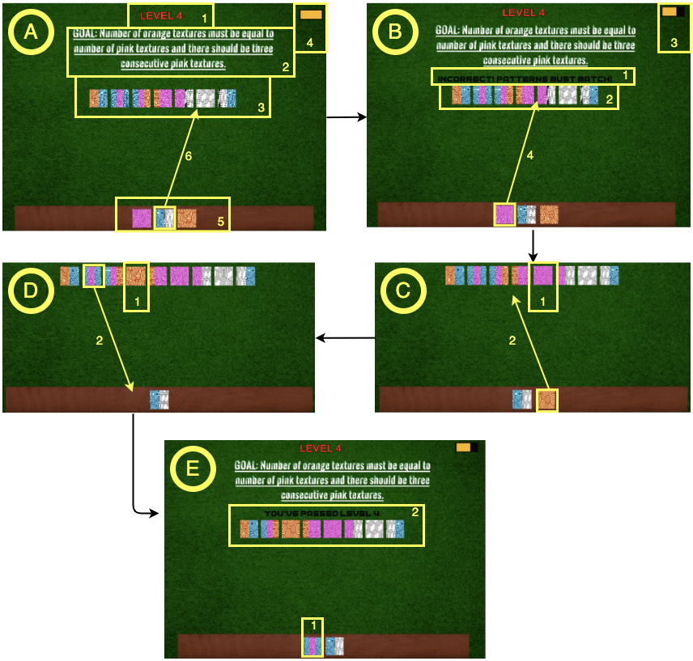

# **BlockList: A Game to Teach Linked List Operations to Novice Programmers**  

🚀 **Presented at:**  
📚 [**15th Annual ACM India Compute Conference (COMPUTE '22)**](https://doi.org/10.1145/3561833.3561844)  

---

## 📄 **Abstract**  
**Linked lists** are a fundamental data structure used in various applications, including **stacks, queues, and trees**. Despite their importance, **novice programmers** often struggle with understanding **insertion, deletion, and memory management** due to their low-level nature.  

💡 **Our Solution:**  
We introduce **BlockList**, an **interactive drag-and-drop game** designed to teach linked list concepts using **visual analogies** instead of traditional code-based explanations.  

🎯 **Key Features:**  
✔️ Hands-on gameplay for **insertion & deletion** of linked list nodes  
✔️ Pattern-based challenges to build **logical thinking**  
✔️ Abstracted concepts to enhance **understanding without syntax barriers**  

**Impact:**  
📝 A survey among **15 first-year undergraduate students** found that **84.88%** agreed the game helped them grasp **basic linked list operations** more effectively!  

---

## **Gameplay Preview**  
> 🏗️ *Arrange the blocks to match the target pattern!*  

🚀 **Drag & Drop Interface** – Intuitive controls to manipulate linked list elements  
🧩 **Engaging Challenges** – Solve puzzles by performing **insertion & deletion**  
📈 **Visual Feedback** – See the impact of your actions in real time  

  
**Descritpion**: _User scenario of Level 4 of BlockList. [A] displays the game's first scene with goal description, block arrangement, a pile of blocks, and a life bar. [B] depicts the scenario when the user takes the wrong step towards the goal. [C] and [D] represent the user's intermediate steps to achieve the goal. [E] shows the final scene where the user achieves the goal and generates the required block arrangement. _

---

## 🎮 **How to Play**  
1️⃣ **Drag & drop** blocks to form a linked list.  
2️⃣ **Insert or delete** nodes based on the given challenge.  
3️⃣ **Solve puzzles** by arranging blocks in the correct sequence.  
4️⃣ **Win levels** and master linked list operations effortlessly!  

📌 *No prior programming experience required!*  

---

## 🛠️ **Installation & Setup**  
1. **Clone the repository:**  
```sh
git clone https://github.com/your-repo/blocklist.git
cd blocklist
```
2. **Install dependencies:**  
```sh
pip install -r requirements.txt
```
3. **Run the game:**  
```sh
python main.py
```
4. **Start playing!** 🎉  

📌 *Works on Windows, macOS, and Linux!*  

---

## 🏆 **Why BlockList?**  
✅ **Beginner-Friendly:** Learn without the complexity of pointers & syntax  
✅ **Gamified Learning:** Makes linked lists fun & interactive  
✅ **Engages Visual Thinkers:** Helps students **visualize memory allocation**  
✅ **Proven Effectiveness:** Backed by real user feedback  

---

## 📢 **Citation**  
If you find **BlockList** helpful, please cite our work:  

```bibtex
@inproceedings{10.1145/3561833.3561844,
  author    = {Rao, A Eashaan and Chimalakonda, Sridhar and Agrahari, Vartika},
  title     = {BlockList: A Game to Teach Basic Linked Lists Operations To Novice Programmers},
  booktitle = {Proceedings of the 15th Annual ACM India Compute Conference},
  year      = {2022},
  pages     = {35–40},
  doi       = {10.1145/3561833.3561844},
  location  = {Jaipur, India},
  series    = {COMPUTE '22}
}
```

---

## 👥 **Meet the Team**  
- 🎓 **A. Eashaan Rao**  
- 🎓 **Vartika Agrahari**
- 🎓 **Sridhar Chimalakonda**    

---

## **Future Plans**  
🔹 More complex **linked list operations** (e.g., circular & doubly linked lists)  
🔹 Levels covering **real-world applications** of linked lists  
🔹 Multiplayer mode for **collaborative learning**  

---

## 💡 **Get Involved!**  
👾 Found a bug? Have suggestions? Open an **issue** or contribute via a **pull request**!  
